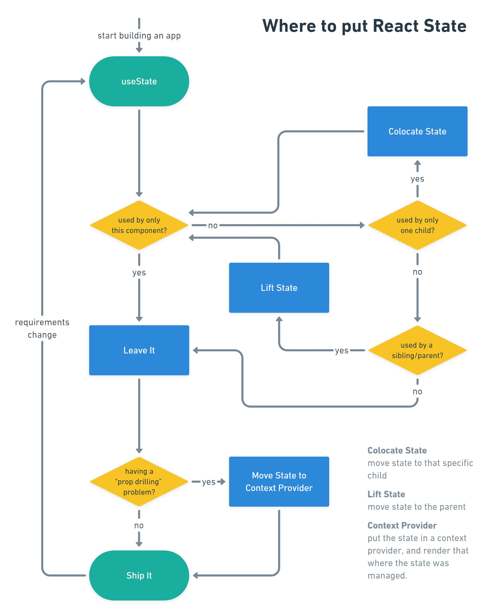

# Coding Conventions and Patterns

There is plenty of content out there on coding conventions and best practices. I
am going to highlight a few items that I have found useful when working by
myself or with large teams:

- [TypeScript Best Practices](#typescript-best-practices)
- [Import order](#import-order)
- [React Components](#react-components)
- [Event props and event handlers](#event-props-and-event-handlers)
- [Structuring content inside function components](#structuring-content-inside-function-components)
- [State Management](#state-management)
- [React Context Pattern](#react-context-pattern)
- [Custom Hooks](#custom-hooks)

## TypeScript Best Practices

- Don't use `any` - it defeats the purpose of using TypeScript. In case you are
  using a 3rd party library that doesn't provide typedefs, it may be ok to use
  `any` for unknown complex types, but avoid it as much as possible.

- Let the TypeScript compiler enforce strong type checking for you. Here's a
  [sample tsconfig file](https://github.com/tsconfig/bases/blob/main/bases/node16-strictest.combined.json)
  with the strictest type checking. Start with this. You may want to relax some
  rules if your existing codebase generates hundreds (or thousands!) of errors,
  but you should be striving for something close to this.

## Import order

The import order guidelines below are intended to keep your imports organized
and easier to scan.

- Start by importing 'react', but only if you need to use something exported
  from it, e.g. `React.Fragment` or `React.useState`. Otherwise, starting from
  React 17, you do not need to import react just to transform JSX (thanks to the
  new JSX transform).
  - Always use this form of import: `import * as React from 'react'`. This is
    called an _ESModules namespace import_.
  - Don't import any named exports like this:
    `import {Fragment, useState} from 'react'`. Instead, use `React.Fragment` or
    `React.useState` directly in your code as needed. See
    [here](https://epicreact.dev/importing-react-through-the-ages/) for a
    detailed explanation.
- Follow by other external imports, sorted by module name. For example, an
  import from `@apollo/client` goes before the import from `react-router-dom`.
- Follow by internal imports, starting with parent directories and ending with
  the current directory. For example, an import from `../../components` goes
  before the import from `./AccountContext`.
- Sort named imports by name. For example,
  `import { Loading, SideBar } from '../../components';`.

**Example**

```tsx
import * as React from 'react';
import { useQuery } from '@apollo/client';
import { useNavigate } from 'react-router-dom';
import { Loading, SideBar } from '../../components';
import { useAccountContext } from './AccountContext';
```

## React Components

- Use PascalCase for both file names and component names.
- Structure your component as a traditional function (vs. a const function
  expression). This is much easier to read and has the advantage of getting
  hoisted.
- Always export your components by name (named exports) (vs. default exports).
  Named exports provide tighter control over the name and also better
  refactoring support by most IDEs. Note that some libraries force you to use
  default exports (e.g. Storybook), in which case you don't have a choice.

**Example: Header.tsx**

```tsx
export function Header() {
  <h1>Catalog</h1>;
}
```

- To pass in props, use an interface (vs. a type). It is easier to extend. If
  you'd like a heuristic, use interface until you need to use features from
  type.
- The name of the interface should be `[ComponentName]Props`. Don't take any
  shortcuts - it's easier to just follow this rule and keep your codebase
  consistent.

**Example with props**

```tsx
interface HeaderProps {
  children?: React.ReactNode;
}

export function Header({ children }: HeaderProps) {
  <h1>{children}</h1>;
}
```

Note: Stop using `React.FC` and `React.FunctionComponent`. React 18 removed the
implicit children property in these types. Use the above construct instead.

**Should I define a return type?**

It is customary to NOT specify the return type from a component and simply rely
on type inference. Technically it could be `React.ReactElement` or even wider
such as `JSX.Element`, but better to let TypeScript infer it than mistakenly
typing it too wide.

**References**

- [How to write a React Component in TypeScript](https://kentcdodds.com/blog/how-to-write-a-react-component-in-typescript)
  by Kent C. Dodds
- [Differences Between Type Aliases and Interfaces](https://www.typescriptlang.org/docs/handbook/2/everyday-types.html#differences-between-type-aliases-and-interfaces) -
  TypeScript docs
- [Removal Of Implicit Children](https://solverfox.dev/writing/no-implicit-children/)
  by Sebastian Silbermann

## Event props and event handlers

Name event props as `onXyz` and event handlers as `handleXyz`. Intent is that
handler names are verbs - they _handle_ an event.

**Example**

In this example, the `AccountDetails` component uses the `AccountSelector`
component which expects to receive a handler. Note that the prop is named
`onAccountSelected` and the handler is named `handleAccountSelected`.

```tsx
// ----- AccountSelector.tsx -----
interface AccountSelectorProps {
  onAccountSelected: (accountId: string) => void;
}

function AccountSelector({ onAccountSelected }: AccountSelectorProps) {
  ...
}

// ----- AccountDetails.tsx -----
function AccountDetails() {
  const handleAccountSelected = (accountId: string) => {
    // hanle account selection
  };

  return <AccountSelector onAccountSelected={handleAccountSelected} />;
}
```

## Structuring content inside function components

Sequence the code in function components as follows:

1. Float all your hooks to the top.
2. Next write your handlers and other functions.
3. Then write any executable logic.
4. Finally, return your markup.

Reason for the first bullet above can be found in React docs
[here](https://reactjs.org/docs/hooks-rules.html). According to these docs,
don't call Hooks inside loops, conditions, or nested functions. Instead, always
use Hooks at the top level of your React function, before any early returns. In
other words, float all Hooks to the top of your component. This will avoid
breaking the rule of Hooks.

**Example**

In the example below, note that 4 hooks are floated to the top.

```tsx
function SignUpPage() {
  // ---------- hooks ----------
  const { authState, setAuthState } = useAuthContext();
  const navigate = useNavigate();
  const [signUp, { error }] = useMutation(SignUpDocument);

  // redirect if user is already logged in
  React.useEffect(() => {
    if (authState.user) {
      navigate('/accounts');
    }
  }, [authState.user, navigate]);

  // ---------- handlers and other functions ----------
  const handleSubmit = async (formEntity: FormEntity) => {};

  // ---------- any executable code ----------
  // e.g. if (loading) { ... }

  // ---------- return markup ----------
  return <SignUpForm signUpError={error?.message} onSubmit={handleSubmit} />;
}
```

## State Management

- When state is needed only by one component, keep it in that component and use
  `useState` for it.
- If you find a component keeping state, but only its child needs it (passed
  using props), then move the state down to the child ("colocate" with the
  child). This is more performant because when state changes only the child is
  rerendered.
- If a component is housing some state which is also needed by the parent and/or
  a sibling, then "lift state" up to the parent.
- If you find that the state in a component is being sent deep down into the
  component tree using props (prop drilling), then move the state into a context
  provider and have the nested components consume it using `useContext`.
- Use React Context for state management

The diagram below nicely summarizes these rules (courtesy Kent C. Dodds):



**References**

- [State Colocation - Where to Put State](https://kentcdodds.com/blog/state-colocation-will-make-your-react-app-faster) -
  explains when to lift state up (so that multiple components can access it) vs.
  push it down, i.e. colocate it (because only one component needs it)
- [Application State Management with React](https://kentcdodds.com/blog/application-state-management-with-react) -
  makes a case for using React Context and Hooks to manage state vs. external
  libraries like Redux
- [Lifting State Up](https://reactjs.org/docs/lifting-state-up.html#lessons-learned) -
  Summary of state sharing best practices

## React Context Pattern

When using React Context, it is convenient to package the provider and the hook
in a single file. This pattern is suggested by Kent C. Dodds in his blog
[How to use React Context effectively](https://kentcdodds.com/blog/how-to-use-react-context-effectively).

**Example**

```tsx
import * as React from 'react';

// ---------- ViewStateContext ----------
type ViewState = { isEditing: boolean };
type ViewStateSetter = (viewState: ViewState) => void;

/** ViewStateContext contains ViewState and ViewStateSetter */
const ViewStateContext = React.createContext<
  { viewState: ViewState; setViewState: ViewStateSetter } | undefined
>(undefined);

// ---------- ViewStateContextProvider ----------
interface ViewStateContextProviderProps {
  children?: React.ReactNode;
}

function ViewStateContextProvider({ children }: ViewStateContextProviderProps) {
  console.log('ViewStateContextProvider.render');
  const [viewState, setViewState] = React.useState<ViewState>({
    isEditing: false,
  });

  const value = { viewState, setViewState };
  return (
    <ViewStateContext.Provider value={value}>
      {children}
    </ViewStateContext.Provider>
  );
}

// ---------- useViewStateContext ----------
function useViewStateContext() {
  const viewStateContext = React.useContext(ViewStateContext);
  if (viewStateContext === undefined) {
    throw new Error(
      'useViewStateContext must be used within a ViewStateContextProvider'
    );
  }
  return viewStateContext;
}

export { ViewStateContextProvider, useViewStateContext };
```

## Custom Hooks

React 16.8 introduced the concept of _Hooks_. They let you use state and other
React features without writing a class. You can read more about hooks in the
[React Docs](https://reactjs.org/docs/hooks-intro.html).

Building your own hooks lets you extract component logic into reusable
functions.

**Example of using a built-in React Hook, without any custom hook**

The component shown below uses `useEffect` to fetch top 10 movies and display
them in a list.

```tsx
// ----- MovieListContainer.tsx -----
export function MovieListContainer() {
  const apiUrl = 'http://localhost:8080/top-10-movies';

  const [isLoading, setIsLoading] = React.useState(false);
  const [isError, setIsError] = React.useState(false);
  const [error, setError] = React.useState<unknown>();
  const [movies, setMovies] = React.useState<Array<Movie>>([]);

  React.useEffect(() => {
    const fetchMovies = async () => {
      try {
        setIsLoading(true);
        const response = await fetch(apiUrl);

        if (response.ok) {
          setData(await response.json());
          setIsLoading(false);
        } else {
          setIsError(true);
          setError(`Error: ${response.status}`);
          setIsLoading(false);
        }
      } catch (error) {
        setIsError(true);
        setError(error);
        setIsLoading(false);
      }
    };

    fetchMovies();
  }, [apiUrl]);

  if (isLoading) {
    return <div>Loading...</div>;
  }

  if (isError) {
    return <h2 className="h5">{(error as any).message}</h2>;
  }

  return (
    <Fragment>
      <h2 className="h5 line-height-none mb-2">Top 10 Movies Of All Time</h2>
      <MovieList movies={movies} />
    </Fragment>
  );
}
```

Note that most of the logic in the component is related to fetching data from
the server and managing its state (`isLoading`, `isError`, `error` etc.). This
is a lot of noise in the component that has nothing to do with the
presentational logic (i.e. displaying of the list). What if there was another
component that also wanted to make an api call to display some other data. We
would have to duplicate the same fetching logic there too. This is a very good
use case for extracting the component logic into a custom hook, thus reducing
the noise in the component and also reusing that logic in other places.

**Example of using a custom React Hook**

Here's the revised code, with the fetching logic extracted into a separate
custom hook. The component itself is now very simple and readable. Also, the
fetching logic in `useFetch` is reusable by other components that need to fetch
data.

```tsx
// ----- MovieListContainer.tsx -----
export function MovieListContainer() {
  const apiUrl = 'http://localhost:8080/top-10-movies';
  const {
    isLoading,
    isError,
    error,
    data: movies,
  } = useFetch<Array<Movie>>(apiUrl);

  if (isLoading) {
    return <div>Loading...</div>;
  }

  if (isError) {
    return <h2 className="h5">{(error as any).message}</h2>;
  }

  if (!movies) {
    return <h2 className="h5">No movies found</h2>;
  }

  return (
    <Fragment>
      <h2 className="h5 line-height-none mb-2">Top 10 Movies Of All Time</h2>
      <MovieList movies={movies} />
    </Fragment>
  );
}
```

```tsx
// ----- useFetch.ts -----
export function useFetch<TData>(apiUrl: string) {
  const [isLoading, setIsLoading] = React.useState(false);
  const [isError, setIsError] = React.useState(false);
  const [error, setError] = React.useState<unknown>();
  const [data, setData] = React.useState<TData>();

  React.useEffect(() => {
    const fetchData = async () => {
      try {
        setIsLoading(true);
        const response = await fetch(apiUrl);

        if (response.ok) {
          setData(await response.json());
          setIsLoading(false);
        } else {
          setIsError(true);
          setError(`Error: ${response.status}`);
          setIsLoading(false);
        }
      } catch (error) {
        setIsError(true);
        setError(error);
        setIsLoading(false);
      }
    };

    fetchData();
  }, [apiUrl]);
  return { isLoading, isError, error, data };
}
```

**Custom Hook Guidelines**

- Try to resist adding abstraction too early. Don’t feel like you have to
  immediately split a component into Hooks. Start spotting cases where a custom
  Hook could hide complex logic behind a simple interface, or help untangle a
  messy component.
- React hooks are just a way to
  - make a part of your component code reusable
  - move a part of your component code into its own "area"
- If your custom hook is not based on other hooks, then strictly speaking you
  don't have a hook, just a vanilla JavaScript function. For example, this is
  not a hook:

```ts
const useLegalAge = (userAge, locale) => {
  if (locale === 'US') {
    return { isLegalAge: userAge >= 21 };
  } else {
    return { isLegalAge: userAge >= 18 };
  }
};
```

**References**

- [Building Your Own Hooks](https://reactjs.org/docs/hooks-custom.html) - React
  Docs
- [What kind of logic React Hooks are there to handle?](https://stackoverflow.com/questions/66115785/what-kind-of-logic-react-hooks-are-there-to-handle) -
  Read the answer to this StackOverflow question
